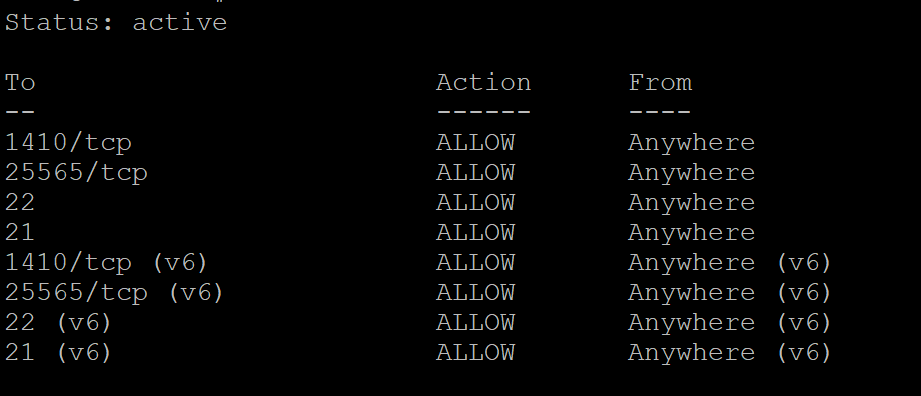

# Firewall Settings

Bei Linux Debian gibt es eine eingebaute Firewall. Mit dieser können wir Ports sperren und somit unsere Sicherheit verbessern. Um herauszufinden, ob die Firewall aktiv ist, können wir den Befehl `ufw status` verwenden.

Vorschau:

<figure><figcaption></figcaption></figure>

### Firewall Ports hinzufügen

Sobald die Firewall aktiviert ist, sind standardmäßig alle Ports gesperrt. Das bedeutet, dass du zuerst die Ports freigeben musst, die du für deine Anwendungen oder Dienste benötigst, wie zum Beispiel SSH. Grundsätzlich sollte man zuerst die Ports 21 und 22 hinzufügen, um SSH-Verbindungen zu ermöglichen.

Um einen Port freizugeben, kannst du einfach folgenden Befehl verwenden:

```
ufw allow <port>
```

Für SSH, sind das üblicherweise die Ports 21 & 22, diese kannst mit dem folgenden Befehl hinzufügen:

```
ufw allow 21
ufw allow 22
```


Bevor du die Firewall aktivierst, stelle sicher, dass die Ports 21 und 22 freigegeben sind. Andernfalls könntest du dich selbst von deinem Server aussperren.


### Firewall Aktivieren

Wenn du sicherstellst, dass alle benötigten Ports freigegeben sind, musst du die Firewall aktivieren. Dazu verwendest du den Befehl:

```
ufw enable
```

Sobald die Firewall aktiviert ist, wird sie alle eingehenden Verbindungen blockieren, die nicht explizit erlaubt wurden, und nur die Ports freigeben, die du mit den oben genannten Befehlen freigegeben hast.
